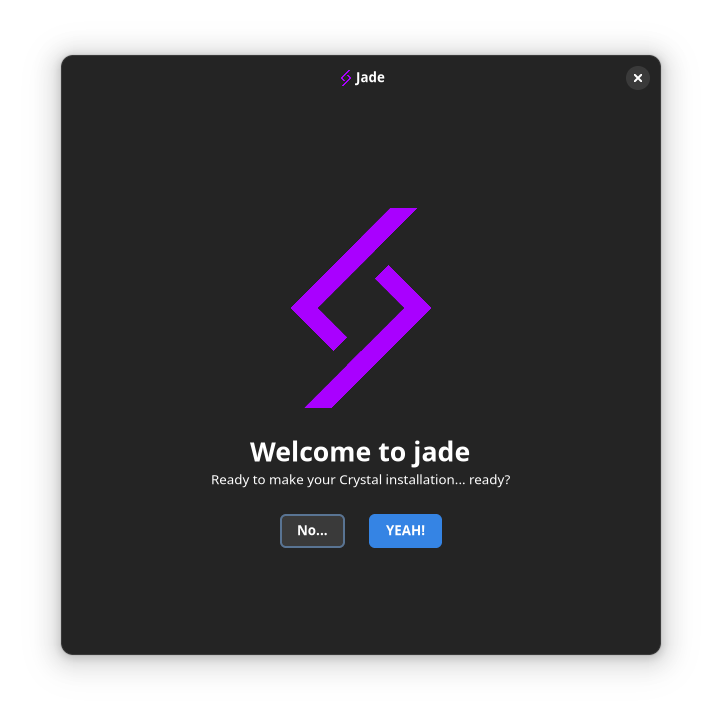

  

<h2 align="center">Jade</h2>

    

 The libadwaita/gtk based gui installer using jade as the backend

 

[The jade gui mockups](https://github.com/crystal-linux/demos-mockups/blob/main/preview.pdf)

